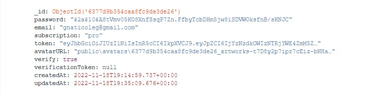
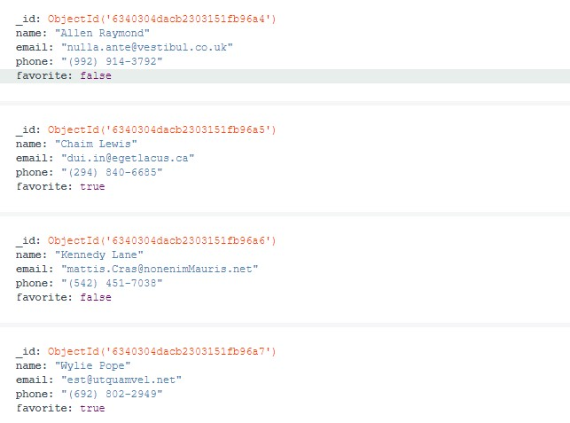

## Backend with user registration and work with his contacts.

### Working with the user:

1. `POST request to /api/users/signup` To register a user. Waiting in the body
   request email and password (the password is hashed). The response comes with
   an email, a field "subscription": "starter", the generated avatar, and the
   verification token. An email is sent to the user with a verification link. If
   a a user with this email already registered will receive the answer
   "message": "Email in use" and 409 Conflict error.

2. `GET request api/users/verify/:verificationToken` To verify the user (the
   token itself is issued to the user upon registration) the "message" response
   comes: "Verification successful" with code 200 OK. In the verification token
   database null is assigned. And the verify field becomes true.

3. `POST request to /api/users/verify` To resend the email for verification
   user. The request body expects the user's email. The answer comes "message":
   "Verification email sent" and code 200 OK.

4. `POST request to /api/users/login` For user login. If a user has not been
   verified, the response is "message": "User: user@gmail.com not
   verified" with code 401 Unauthorized. If the user has been verified, a token
   is issued to him and the code 200 OK comes.

5. `GET request /api/users/logout` To log out the user. waiting in Authorization
   token, if the token is received message invalid token if all the code 204 No
   Content is successfully received and the value of null is given to the token.

6. `GET request /api/users/current` To get data on the current user which is
   logged in, an email, and a subscription type with a status of 200 OK are
   received in response. Available only for the logged-in user. In case of
   sending a request an unregistered user will receive the response "message":
   "Not authorized" with error 401: Unauthorized.

7. `PATCH request /api/users ` To update the subscription (subscription)
   Subscription must have one of the following values ​​['starter', 'pro'
   'business']) in the body expects subscription to one of these values
   ​​['starter', 'pro' 'business']. AT if the user did not enter information in
   the request body, the response will be "message": "\"subscription\" is
   required" and 400 Bad Request code. When successful, the user gets all the
   information about himself.

    Available only for the logged-in user. In case of sending a request an
    unregistered user will receive the response "message": "Not authorized" with
    error 401: Unauthorized.

8. `PATCH request /api/users/avatars` To update the user's avatar (when
   registration is assigned automatically). Expect a form-data body with a field
   avatar and the file itself. Implemented moving a file from a temp folder to a
   folder public. The response comes "avatarURL": "public\\avatars\\avatar.jpg"
   with code 200 OK.

    

### Working with contacts:

1. `GET request to /api/contacts ` To get all of the user's contacts. Available
   only for a registered user in the response comes { "result": [], "page": 1,
   "limit": 5 } with status 200 OK. In case of sending the request for an
   unregistered user will receive the response "message": "Not authorized" with
   error 401: Unauthorized.

2. `POST request to /api/contacts` To add a new contact. Available only for
   registered users. Expects in the request body name, email, phone in the
   response comes the information that the user entered, id, field favorite is
   false by default, the owner of the contact, and the time and date of creation
   and the last contact changed with status 201 Created.

```
{
    "name": "john",
    "email": "john@mail.com",
    "phone": "12345678",
    favorite: false
    "owner": "6377d9b354caa8fc9de3de26",
    "_id": "6377e04b54caa8fc9de3de52",
    "createdAt": "2022-11-18T19:43:07.792Z",

    "updatedAt": "2022-11-18T19:43:07.792Z"
}
```

In case of sending a request, an unregistered user will receive a response
"message": "Not authorized" with error 401: Unauthorized.

3. `GET request /api/contacts/:id` To get contact by ID with status 200 OK.
   Available only for registered users. In case of sending a request for an
   unregistered user will receive the response "message": "Not authorized" with
   error 401: Unauthorized.

4. `DELETE request /api/contacts/:id` To delete a contact by ID in response
   comes { "message": "contact deleted" } with status 200 OK. Available only for
   registered users. In case of sending a request an unregistered user will
   receive the response "message": "Not authorized" with error 401:
   Unauthorized.

5. `PUT request /api/contacts/:id` To update a contact by ID. Waiting in the
   body phone, name, and email request, the response comes with updated
   information from status 200 OK. Available only for registered users. AT if a
   request is sent by an unregistered user, a response will be received
   "message": "Not authorized" with error 401: Unauthorized.

6. `PATCH request /api/contacts/:id/favorite` To update the favorite field of
   contact by ID. Expects in the body of the request boolean in the response
   comes updated information with status 200 OK . Available only for registered
   users. In case of sending a request, to an unregistered user the response
   will be "message": "Not authorized" with a 401: Unauthorized error.

7. `GET request /api/contacts?page=1&limit=20` To get all contacts from
   pagination, you can substitute dynamic values. Only available for an
   unregistered user will receive the response "message": "Not authorized" with
   error 401: Unauthorized.



### Commands:

-   `npm start` &mdash; start server in production mode

-   `npm run start:dev` &mdash; server start in development mode (development)

-   `npm run lint` &mdash; start code review with eslint, Necessarily carry out
    before dermal PR and administering all linter breaks

-   `npm lint:fix` &mdash; and re-verification of the linter, but automatic
    corrections of simple pardons
